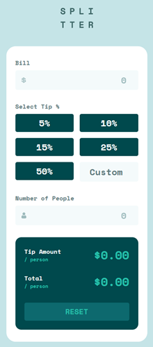
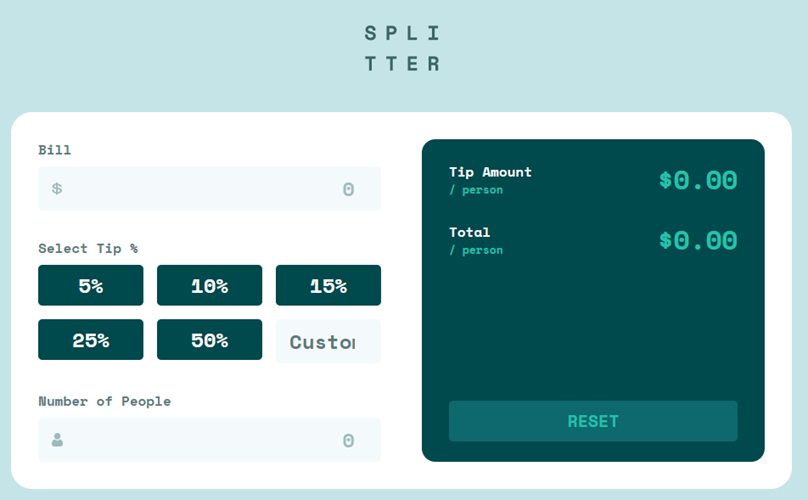

# Tip Calculator App




## 1. General summary from the app

I built this project as a small interactive financial calculator focused on accuracy, accessibility, and maintainable FrontEnd structure. Although the product scope is intentionally simple, the implementation shows a clear technical intention: I did not keep all the logic inside a single script, but separated calculation, parsing, validation, DOM selection, event binding, and rendering into dedicated TypeScript modules inside `src/`.

The use of TypeScript, Vite, Vitest, happy-dom, and Playwright suggests that I am training myself as a FrontEnd developer oriented toward code quality and testable user interfaces. These tools help me validate business logic, DOM behavior, and complete user flows instead of relying only on manual browser testing.

For a small Frontend Mentor challenge, TypeScript plus unit and end-to-end testing can be considered more than the minimum required setup. In this case, that extra structure is reasonable because it communicates professional ambition: I am practicing habits expected in production teams, such as strict typing, modular code, automated tests, and accessibility-aware markup.

The strongest foundation to keep consolidating is the connection between product behavior and engineering discipline: accurate calculations, clear validation, accessible form controls, responsive layout, and repeatable test commands.

## 2. Main function of the application

I built a tip calculator that helps users split a bill by calculating the tip amount per person and the total amount per person. From a product perspective, the app solves a focused real-world task: entering a bill, choosing or typing a tip percentage, setting the number of people, and receiving immediate per-person totals.

A minimum user flow is:

1. I enter the bill amount.
2. I select a predefined tip percentage or type a custom percentage.
3. I enter the number of people and the app displays the tip and total per person.

The primary use cases are quick restaurant bill splitting, testing a custom tip percentage, resetting the calculator after a completed calculation, and receiving validation feedback when the number of people is invalid.

## 3. Technologies in the project

- Languages: HTML, CSS, and TypeScript. TypeScript is configured with strict mode enabled in `tsconfig.json`, which helps catch type errors earlier.
- Application architecture: The code is organized by responsibility in `src/`, with calculation logic in `src/core/calculator.ts`, input parsing in `src/core/parsers.ts`, validation in `src/core/validators.ts`, DOM access in `src/dom/`, and UI behavior in `src/ui/`.
- Testing: Vitest is used for unit and integration-style DOM tests, with happy-dom as the browser-like test environment.
- End-to-end testing: Playwright is configured in `playwright.config.ts` and covers key user flows in `e2e/tip-calculator.spec.ts`, including correct calculations, custom tip priority, validation feedback, accessibility attributes, and reset behavior.
- Accessibility: The HTML uses form labels, fieldset and legend for tip selection, screen-reader-only headings, `output` elements, `aria-invalid`, `aria-describedby`, `role="alert"`, and `aria-live="polite"` for validation feedback.
- Responsive design: CSS uses mobile-first layout decisions, CSS Grid for the form/results layout, media queries at `48rem` and `64rem`, and responsive container widths through custom properties in `style.css`.
- UI quality: CSS custom properties define design tokens for colors, spacing, typography, border radius, and motion

## 4. How to run locally

Clone the repository:

```bash
git clone <repository-url>
cd tip-calculator-app
```

Install dependencies:

```bash
pnpm install
```

Start the development server:

```bash
pnpm dev
```

Create a production build:

```bash
pnpm build
```

Run unit tests:

```bash
pnpm test
```

Run end-to-end tests:

```bash
pnpm e2e
```

## 5. Knowledge I learned in this project

- I practiced structuring a vanilla FrontEnd application with TypeScript while keeping responsibilities separated and understandable. I learned how to isolate pure calculation logic from DOM-related code, which makes the app easier to test and reason about.

- I reinforced form handling skills: reading input values, parsing strings into numbers, validating user input, handling custom and predefined tip selections, and keeping the reset behavior consistent with the current state of the form.

- I improved my accessibility awareness by using native form elements, labels, fieldsets, screen-reader-only text, live regions, `aria-invalid`, and visible focus styles. I also learned that accessibility is not only about markup, but also about how validation feedback is announced and how interactive controls behave with the keyboard.

- I practiced responsive CSS with design tokens, CSS Grid, media queries, mobile-first layout decisions, hover behavior for fine pointer devices, and reduced-motion preferences. This helped me connect visual implementation with user comfort and device differences.

- I also learned how to add confidence through automated testing. Vitest helped me validate calculation, parsing, validation, and rendering behavior, while Playwright helped me verify complete user journeys in the browser.
